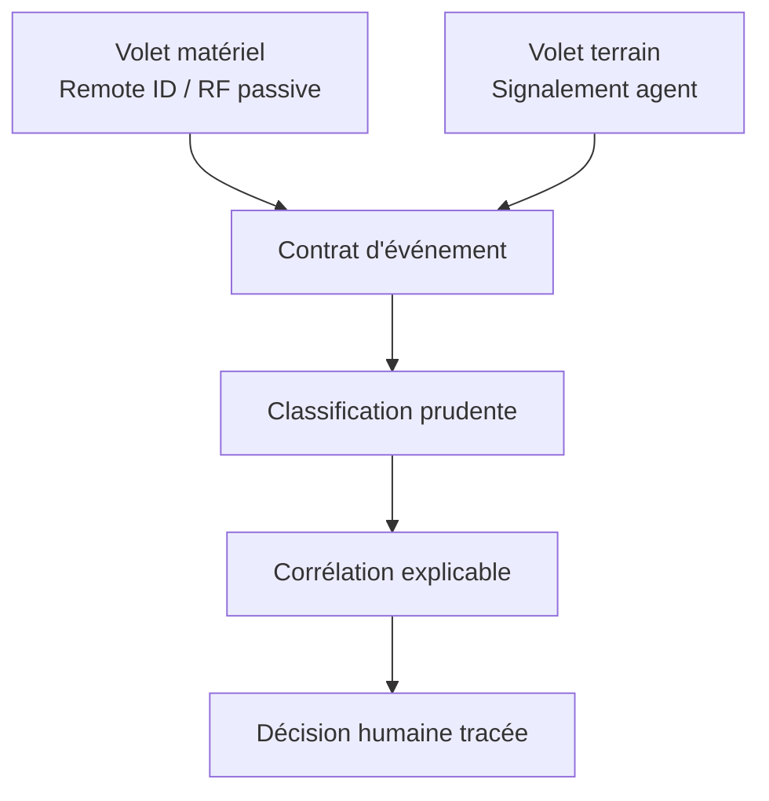

# VIGIE — Corréler pour mieux vérifier

VIGIE est un prototype en deux volets pour la sûreté aéroportuaire :

1. **réception passive** de signaux Remote ID, puis exploration RF générique ;
2. **logiciel de recoupement** qui normalise les événements, propose des liens
   explicables et conserve la décision d'un responsable humain.

Le projet ne neutralise aucun drone et ne prend aucune décision autonome.

[Démonstration en ligne](https://vigie.josephhounto.workers.dev/) ·
[Architecture](docs/ARCHITECTURE.md) ·
[État du prototype](docs/ETAT_DU_PROTOTYPE.md) ·
[Dossier de candidature](dossier/README.md)

## État vérifiable

| Élément | État actuel | Preuve dans le dépôt |
|---|---|---|
| Contrat d'événement | Implémenté | `schema/migration.sql` |
| Corrélation lieu/heure | Exécutable et testée localement | `src/correlation/`, `tests/` |
| Ingestion FAA | Parseur testable sur un fichier fourni séparément | `src/ingest/`, `tests/` |
| Classification assistée par IA | Implémentée avec repli prudent | `src/classification/`, `tests/` |
| Interface de signalement | Démonstrateur local, sans backend | `src/interface/` |
| Carte de contexte | Démonstrateur sur JSON local | `src/dashboard/` |
| Réception Remote ID réelle | À valider sur le terrain | `src/capture/remote_id_capture_stub.py` |
| Détection RF générique | Extension de recherche | `src/capture/rf_capture_stub.py` |
| Pipeline intégré et base réelle | Non connecté | feuille de route |

Les données affichées sur le site sont simulées ou externes et portent un statut
de preuve. Aucune donnée de sûreté togolaise réelle n'est publiée.

## Architecture en deux volets



Le moteur actuel rapproche uniquement le **lieu** et le **temps**. Les identifiants
Remote ID, positions de contrôle, trajectoires et contradictions entre couches sont
des capacités prévues, pas encore revendiquées comme implémentées.

## Installation

Prérequis : Python 3.11 ou plus récent.

```bash
python -m venv .venv
source .venv/bin/activate
python -m pip install --upgrade pip
python -m pip install -e '.[dev]'
PYTHONPATH=src python -m unittest discover -s tests -v
```

### Démonstration locale

```bash
python src/simulate/generate_test_events.py --seed 2026 --count 12 \
  --output src/dashboard/evenements_simules.json
python -m http.server 8000 --directory src/dashboard
```

Ouvrir ensuite `http://localhost:8000`.

### Classification sans clé

```bash
python src/classification/classifier.py
```

Sans clés API, le module retourne volontairement `a_verifier` avec un score prudent.
Les clés éventuelles doivent être configurées dans l'environnement :
`GROQ_API_KEY` et `GEMINI_API_KEY`.

Les tests principaux n'ont besoin d'aucun service externe :

```bash
PYTHONPATH=src python -m unittest discover -s tests -v
```

## Structure du dépôt

```text
VIGIE/
├── .github/workflows/       # intégration continue
├── data/                    # référentiels publics et documentés
├── docs/                    # architecture, preuves, limites et protocoles
├── dossier/                 # pièces de candidature
├── schema/                  # contrat SQL commun, sécurisé par défaut
├── site/                    # fiche publique et démonstration
├── src/
│   ├── capture/             # volet matériel, encore expérimental
│   ├── classification/      # aide au classement, jamais décision finale
│   ├── correlation/         # rapprochement déterministe
│   ├── dashboard/           # carte locale de démonstration
│   ├── ingest/              # adaptateurs de données externes
│   ├── interface/           # signalement agent local
│   └── simulate/            # scénarios reproductibles
├── tests/                   # tests unitaires et de contrat
├── pyproject.toml           # dépendances et outils de qualité
└── SECURITY.md              # limites de sécurité avant pilote réel
```

## Données et preuve

- Les référentiels togolais sont décrits dans [`data/README.md`](data/README.md).
- Les données FAA servent uniquement à vérifier l'extraction de texte externe.
- Un import FAA sans coordonnées ne valide pas la corrélation spatio-temporelle.
- La simulation fournit une vérité terrain contrôlée ; elle n'est jamais présentée
  comme une observation réelle.

## Contribuer

Lire [`CONTRIBUTING.md`](CONTRIBUTING.md), créer une branche courte, ajouter ou
mettre à jour les tests, puis ouvrir une Pull Request. Toute évolution du contrat
commun ou du périmètre matériel doit être discutée avant implémentation.

## Limites non négociables

- aucune neutralisation, émission ou prise de contrôle ;
- aucune donnée réelle avec les droits de prototype ;
- aucune confirmation opérationnelle produite par un modèle d'IA ;
- aucune confusion entre donnée mesurée, rapportée, simulée ou externe ;
- aucune clé ou donnée personnelle dans le dépôt.

Le vocabulaire de maturité utilisé par VIGIE est détaillé dans
[`docs/ETAT_DU_PROTOTYPE.md`](docs/ETAT_DU_PROTOTYPE.md).
