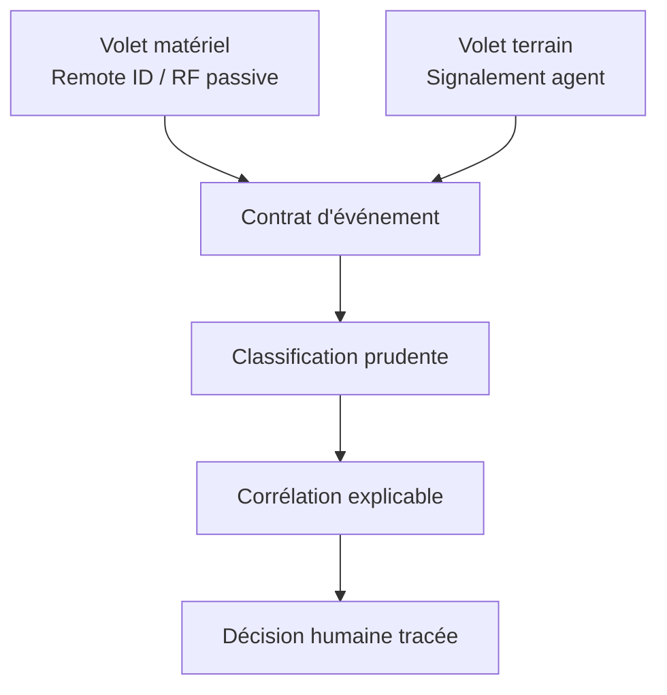

# VIGIE — Corréler pour mieux vérifier

> Projet CNISAI/AVSEC 2026 — catégorie Innovation libre.

VIGIE est un prototype de sûreté aéroportuaire qui rapproche des observations
issues du terrain et de capteurs passifs afin d'aider un responsable humain à
comprendre une situation plus vite, sans transformer une alerte isolée en vérité.

Le projet repose sur **deux volets complémentaires** :

1. un volet matériel de réception passive Remote ID et d'exploration RF ;
2. un volet logiciel qui normalise, classe prudemment et recoupe les événements.

**Principe en une phrase :** réunir des signaux hétérogènes dans un même contrat
de données, proposer des liens explicables, puis conserver une décision humaine
traçable.

## 🚀 Pour commencer

| Besoin | Aller à |
|---|---|
| Comprendre VIGIE en 5 minutes | [`docs/ARCHITECTURE.md`](docs/ARCHITECTURE.md) |
| Savoir exactement ce qui fonctionne | [`docs/ETAT_DU_PROTOTYPE.md`](docs/ETAT_DU_PROTOTYPE.md) |
| Voir la démonstration | [vigie.josephhounto.workers.dev](https://vigie.josephhounto.workers.dev/) |
| Suivre l'évolution du projet | [`docs/journal.md`](docs/journal.md) |
| Consulter le dossier de candidature | [`dossier/README.md`](dossier/README.md) |
| Chercher un terme technique | [`docs/glossaire.md`](docs/glossaire.md) |

## 📂 Dossier de candidature

Le statut des **8 pièces demandées** et les documents de travail disponibles sont
centralisés dans [`dossier/`](dossier/README.md). Les exports Word et PDF doivent
être réalignés sur l'état technique actuel avant leur utilisation finale.

## Architecture en deux volets



- **Volet matériel** : reçoit des signaux sans brouillage ni prise de contrôle.
- **Volet terrain** : permet de structurer une observation humaine.
- **Volet logiciel** : rapproche actuellement le lieu et le temps entre deux
  sources identifiées et différentes.
- **Responsable humain** : confirme, corrige ou rejette la proposition du système.

Les identifiants Remote ID, trajectoires, positions de contrôle et contradictions
entre couches font partie de la feuille de route ; ils ne sont pas encore présentés
comme des capacités validées.

## État actuel, preuves à l'appui

| Brique | État actuel | Preuve |
|---|---|---|
| Contrat commun d'événement | Implémenté | [`schema/migration.sql`](schema/migration.sql) |
| Corrélation lieu/heure | Exécutable et testée | [`src/correlation/`](src/correlation/) · [`tests/`](tests/) |
| Classification assistée | Implémentée avec repli prudent | [`src/classification/`](src/classification/) |
| Génération de scénarios | Reproductible | [`src/simulate/`](src/simulate/) |
| Interface et carte | Démonstrateurs locaux | [`src/interface/`](src/interface/) · [`src/dashboard/`](src/dashboard/) |
| Réception Remote ID réelle | À valider sur le terrain | [`src/capture/`](src/capture/) |
| Base et pipeline intégrés | Non connectés | [`docs/feuille_route.md`](docs/feuille_route.md) |

Le niveau de maturité détaillé, les preuves acquises et les éléments restant à
démontrer sont maintenus dans [`docs/ETAT_DU_PROTOTYPE.md`](docs/ETAT_DU_PROTOTYPE.md).

## 🧭 Explorer le projet

### Comprendre les usages et le cadre

| Besoin | Document |
|---|---|
| Voir VIGIE en action sur des scénarios | [`docs/cas_usage.md`](docs/cas_usage.md) |
| Étudier des précédents aéroportuaires | [`Gatwick`](docs/cas_reel_gatwick.md) · [`OR Tambo`](docs/cas_reel_or_tambo.md) |
| Comprendre les niveaux L0 à L5 | [`docs/feuille_route.md`](docs/feuille_route.md) |
| Lire les règles du concours | [`docs/programme_concours.md`](docs/programme_concours.md) |
| Examiner l'éthique et les limites | [`docs/ethique.md`](docs/ethique.md) · [`SECURITY.md`](SECURITY.md) |

### Volet matériel

| Besoin | Document |
|---|---|
| Commencer par un exercice concret | [`docs/guide_pratique_rf.md`](docs/guide_pratique_rf.md) |
| Comprendre les choix RF | [`docs/construction_rf.md`](docs/construction_rf.md) |
| Consulter le matériel envisagé | [`docs/materiel.md`](docs/materiel.md) |
| Préparer un essai autorisé | [`docs/protocole_test.md`](docs/protocole_test.md) |
| Réaliser l'exercice pédagogique | [`docs/guide_diy_reflecteur.md`](docs/guide_diy_reflecteur.md) |

### Volet logiciel, données et recherche

| Besoin | Document |
|---|---|
| Comprendre le contrat d'événement | [`docs/contrat_evenement.md`](docs/contrat_evenement.md) |
| Connaître les données de test | [`docs/donnees.md`](docs/donnees.md) |
| Consulter les référentiels publics | [`data/README.md`](data/README.md) |
| Voir les recherches à poursuivre | [`docs/manus_recherches.md`](docs/manus_recherches.md) |
| Contribuer sans conflit | [`CONTRIBUTING.md`](CONTRIBUTING.md) |

## Démonstration locale

Prérequis : Python 3.11 ou plus récent.

```bash
python -m venv .venv
source .venv/bin/activate
python -m pip install --upgrade pip
python -m pip install -e '.[dev]'
PYTHONPATH=src python -m unittest discover -s tests -v
```

Générer ensuite un scénario reproductible et ouvrir la carte :

```bash
python src/simulate/generate_test_events.py --seed 2026 --count 12 \
  --output src/dashboard/evenements_simules.json
python -m http.server 8000 --directory src/dashboard
```

Ouvrir `http://localhost:8000`. Sans clés API, le classificateur retourne
volontairement `a_verifier` avec une priorité prudente ; les tests principaux
n'ont besoin d'aucun service externe.

## Structure du dépôt

```text
VIGIE/
├── .github/workflows/       # intégration continue
├── data/                    # référentiels publics documentés
├── docs/                    # architecture, preuves et protocoles
├── dossier/                 # pièces de candidature
├── schema/                  # contrat SQL sécurisé par défaut
├── site/                    # présentation et démonstration publique
├── src/
│   ├── capture/             # réception passive, encore expérimentale
│   ├── classification/      # aide au classement
│   ├── correlation/         # rapprochement déterministe
│   ├── dashboard/           # carte locale
│   ├── ingest/              # adaptateurs de données externes
│   ├── interface/           # signalement terrain
│   └── simulate/            # scénarios reproductibles
├── tests/                   # tests unitaires et de contrat
├── pyproject.toml           # dépendances et outils de qualité
└── SECURITY.md              # conditions avant un pilote réel
```

## Qui touche quoi

- **Matériel** : travaille dans `src/capture/` et produit des événements conformes
  au contrat commun.
- **Logiciel** : travaille dans `src/classification/`, `src/correlation/`,
  `src/interface/` et `src/dashboard/` avec des scénarios simulés.
- **Données** : documente chaque provenance dans `data/` et distingue mesure,
  signalement, simulation et source externe.
- **Dossier** : s'appuie sur les preuves du dépôt sans transformer une capacité
  prévue en résultat acquis.

Cette séparation permet aux deux volets d'avancer indépendamment tout en restant
compatibles par le même contrat d'événement.

## Règles non négociables

- aucune neutralisation, émission ou prise de contrôle d'un appareil ;
- aucune confirmation opérationnelle décidée par un modèle d'IA ;
- aucune donnée réelle dans une base conservant les droits du prototype ;
- aucune confusion entre donnée mesurée, rapportée, simulée ou externe ;
- aucune clé API ni donnée personnelle dans le dépôt.

VIGIE est aujourd'hui un **prototype structuré et testable**, pas un système
opérationnel certifié. Sa valeur est de rendre le recoupement démontrable,
progressif et auditable jusqu'à un futur essai autorisé.

## Contribuer

Lire [`CONTRIBUTING.md`](CONTRIBUTING.md), créer une branche courte, ajouter ou
mettre à jour les tests, puis ouvrir une Pull Request. Toute évolution du contrat
commun ou du périmètre matériel doit être discutée avant implémentation.
